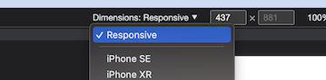
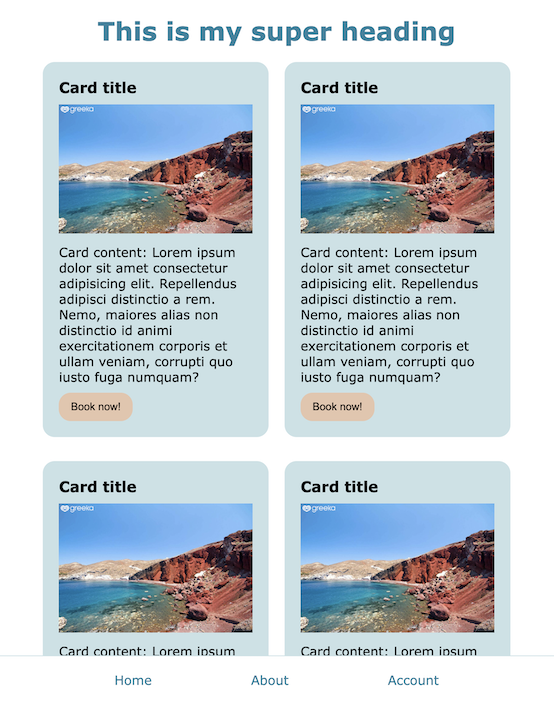
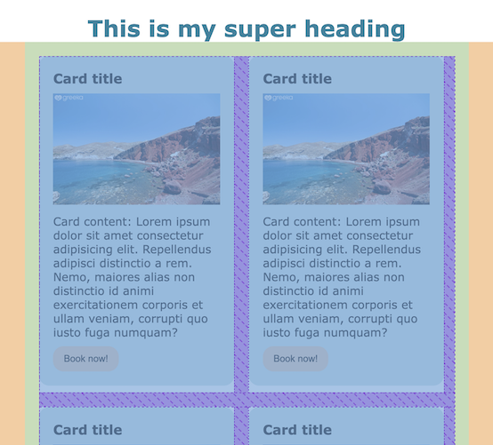
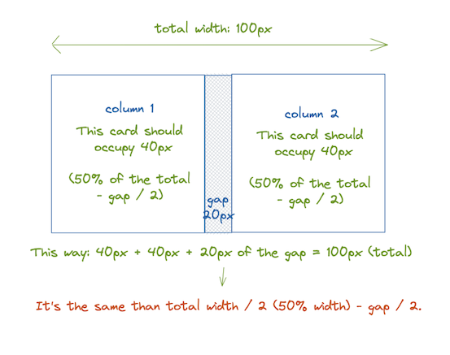
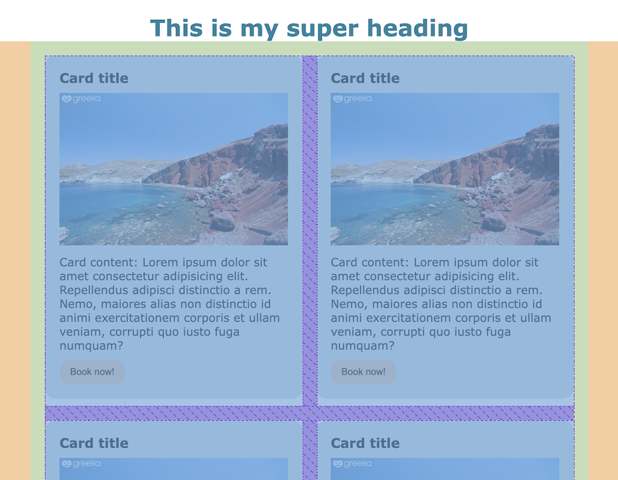

# CSS Challenge #2 📱 The mobile-first approach

Today we will learn about turning a mobile-only page into a *mobile-first* page:


## But first: what does mobile-first mean? 📝

Traditionally, websites were designed and styled to be seen on desktop computers (because that's all there was). When people started having PDAs, iPads and such, *responsive* design appeared. Responsive design meant that once you had your page styled, you had to add styles for smaller screens.


A *mobile-first* approach to design means that the **first CSS code writen** is the one seen on a smartphone screen. Why? Because:

1. It is the **simpler one**: elements are usually stacked on top of each other, there are no complicated grids, etc.
2. It is -most likely- **the most important one**: there is a really good chance, nowadays, that people are going to browse your website from a smartphone (because, let's face it, that's ALL we do all day.)

Once the mobile style is finished, you move on to styling bigger screen sizes with the help of our friends, the **media queries** and **breakpoints**.

**Breakpoints**

A breakpoint is the size at which some elements of the design change. The most common and used breakpoints are:

|  Screen | Size  |
|---|---|
| Mobile  | Up to 568px approx |
| Tablet portrait  | 768px  |
| Tablet landscape  | 1024px  |
| Desktop screens | 1200px and more |

However, this is just a standard; then creating your projects, feel free to choose whichever breakpoint you consider fitting.


---

## What's in the code? 🤓

You already have all the styles for the mobile design. Open the project, inspect it with any mobile size and it should be fine.

You are also given some variables. Remember that you can use them with the word <code>var</code>:

```css
color: var(--primary-blue);
```

⚠️ For this project, you don't need to touch the HTML file, ONLY the CSS file.

⚠️ To do this exercise, get familiar with the "responsive" tool of Google Chrome, that allows you to change the size of the "fake" screen, and even set a screen of 3000px if you want (even if your laptop screen is not that big).



---

## Iteration 1: From one column to two columns

The first breakpoint we will take into account for our project is the tablet screen (from 568px and up). Think about what we want:

- Each column of cards, instead of occupying the 100% of their container, they should occupy the 50% (about half the parent).
- All the elements are centered in the screen:



### How does a media query work?

Media queries work with the following syntax, and we ONLY include the elements that change from the other CSS code (for instance, the navbar will stay the same throughout all the different screens, so we don't need to change anything):

```css
@media (min-width: 568px){
  .selector {
    property: value;
  }
  .selector-2 {
    property: value;
  }
}
```

We can also combine different media queries. For instance, if we wanted some styles only in a certain range of pixels:

```css
@media (min-width: 568px) and (max-width: 798px){
  .selector {
    property: value;
  }
}
```


We could also write different styles for a screen when the user is using the device vertically (*orientation: portratit*) or horizontally (*orientation landscape*):

```css
@media (min-width: 768px) and (orientation: portrait){
  .selector {
    property: value;
  }
}
```

But, for now, our media queries are going to be very simple and we are not going to combine them.

---
### Time to code 🎬

Try to write your own CSS and check the solution before moving on to the next iteration.

When the user is browsing in a screen **from 568px and upwards**:

- The header h1 will be aligned to the center
- The card itself, instead of occupying the 100% of its parent, should occupy the 50%, but, for now, let's say it occupies the 47% to take into account the separation between cards (we will fix that later)
- The "card-container" div, from this point on, should not be bigger than 90% of the viewport's width
- The "card-container" div should have a property that displays the cards in a flexible way, and, when they don't fit anymore, they should *wrap*. You might want to check [this cheetsheat](https://css-tricks.com/snippets/css/a-guide-to-flexbox/) to refresh your memory.
- The "card-container" should also tell all their children cards to have a gap (a separation) between them of 20px. [Look for a property](https://css-tricks.com/snippets/css/a-guide-to-flexbox/) for that (*hint: that separation between columns and rows is NOT a margin and is NOT a padding*).
- The whole "card-container" div should be centered. You can achieve that by telling it to automatically calculate the possible margin on the sides with <code>margin: auto</code>. *💡 By the way, this property won't work on inline elements*.

<details>
<summary>Check for the solution</summary>

```css
/* Tablets */

@media (min-width: 568px) {
  header h1 {
    text-align: center;
  }

  section.card {
    width: 47%;
  }

  div.card-container {
    max-width: 90vw;
    display: flex;
    flex-wrap: wrap;
    gap: 20px;
    margin: auto;
  }
}
```

</details>
<br>

So far so good, but if you inspect it closely, it doesn't look pixel-perfect (see all that purple space on the right that doesn't belong?). We only want the separation between columns and rows and we want the rest to be perfectly centered:



That's because we told the cards to be 47% width, because if we set them to 50% + the 20px from the gap, it equals more than 100%, and the second column of cards wraps down because it doesn't fit (try it if you don't believe me!). But the right width is not 47%, it's somewhere between there and 50%. So let's improve this code.

---

## Iteration 2: The gap matter

First of all, create a new variable for the gap, because we will be using it quite a lot. It should be called **--main-gap** and it should be set to 20px. Then, substitute the value inside the media query for the variable you just created.

<details>
<summary>Check for the solution for this part</summary>

```css
:root {
  --main-gap: 20px;
  /* ... */
}

@media (min-width: 568px) {
  div.card-container {
    /* ... */
    gap: var(--main-gap);
  }
}
```
</details>
<br>

### Now: which width should the cards have?

Now, let's think about this for a second:


To be exact, each card should occupy 50% of the space, minus that gap in the middle, to leave space for it and make sure our total is 100% exactly. 

But since we have two columns, we have to distribute half of that gap space to each column, so the right formula should be: *each card should have a width of 50% minus gap / 2*. 

If it is hard to understand, image the following scenario:



This is the same, only we don't know that total width, because it changes as the screen increases. So, how can we make it dynamic? <code>Calc</code> to the rescue!

CSS has a [property **calc**](https://developer.mozilla.org/en-US/docs/Web/CSS/calc) that allows you to do simple mathematic operations. You can add, substract, multiply and divide, and use all kinds of measure units (even variables). It is pretty cool! Here is an example:

```css
margin: calc(20px + 1rem);
```

 So, in our code, let's change that 47% for:

```css
  section.card {
    width: calc(50% - var(--main-gap) / 2);
  }
```

NOW it looks pixel-perfectly centered, even as you make the screen bigger and smaller. Only way to do CSS 😉



---

## Iteration 3: Three columns

For screens of 1024px and bigger, user should see three columns. 
This means, that there will be two gaps (two empty spaces between the three columns). So:
- The card should be 33.33% minus the gap * 2 spaces, to distribute among 3 columns

<details>
<summary>Check for the solution</summary>

```css
/* Desktop */

@media (min-width: 1024px) {
  section.card {
    width: calc(33.33% - var(--main-gap)*2 / 3);
  }
}
```
</details>

---

## Iteration 4: Four columns

For screens of 1300px and bigger, user should see four columns. 
This means, that there will be three gaps (three empty spaces between the four columns). So:
- The card should be 25% of the space minus the gap * 3 spaces, to distribute among 4 columns

<details>
<summary>Check for the solution</summary>

```css
/* Bigger screens */

@media (min-width: 1300px) {
  section.card {
    width: calc(25% - var(--main-gap)*3 / 4);
  }
}
```
</details>


All done! ✅

